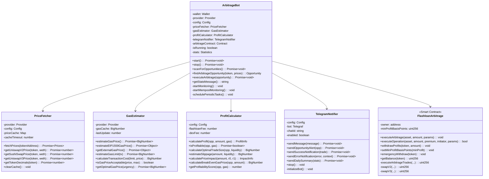
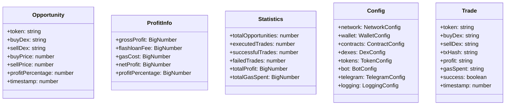
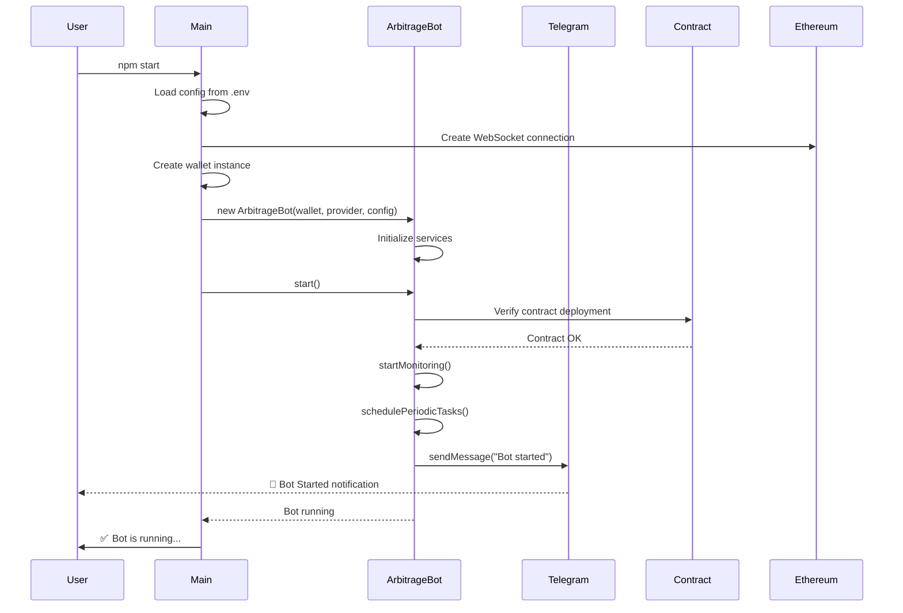
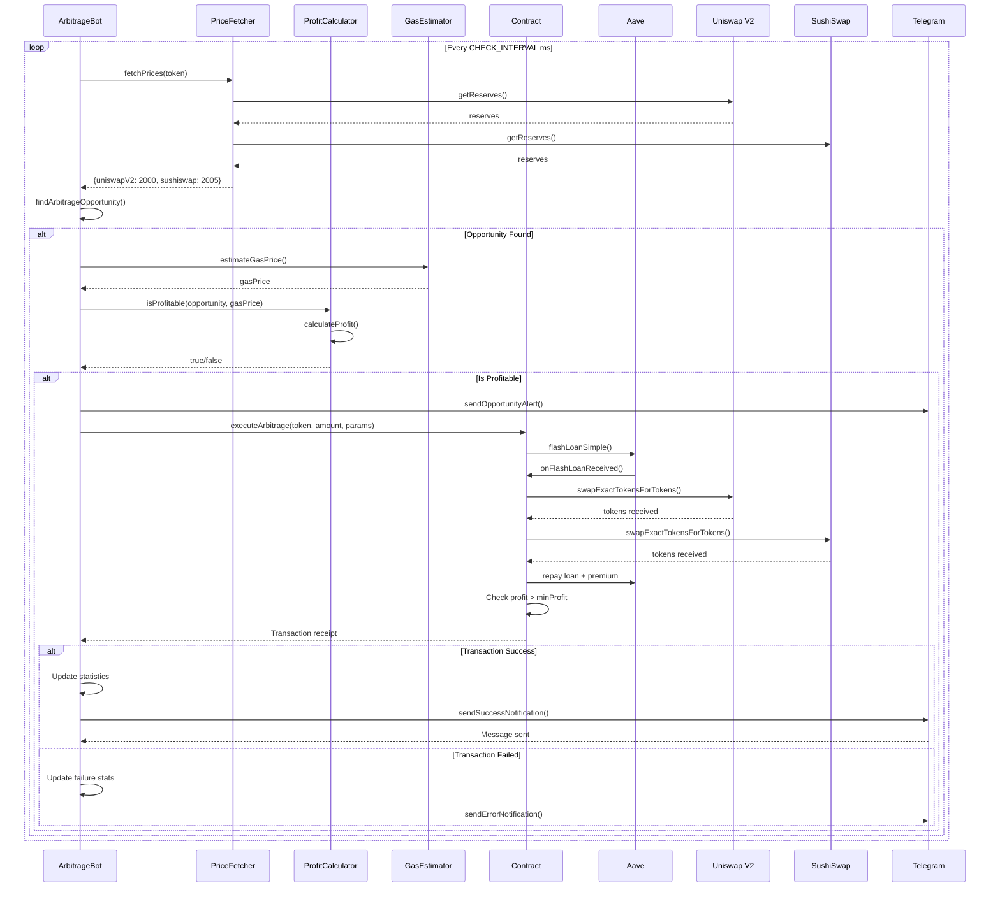
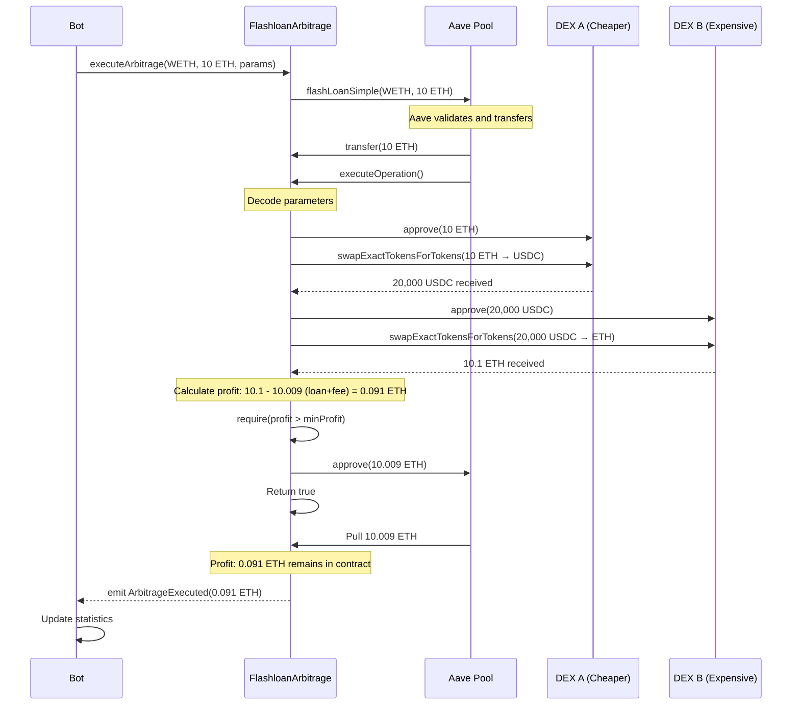
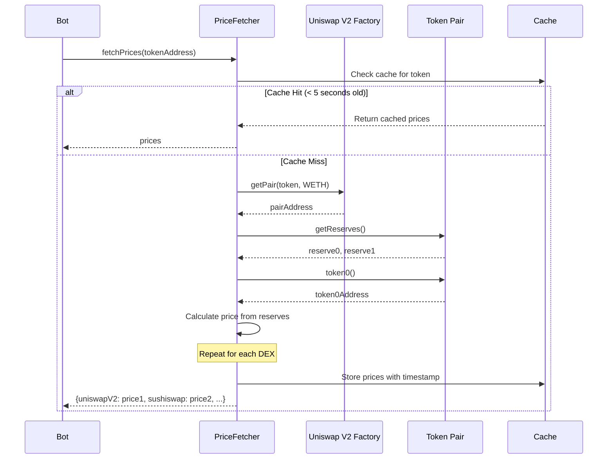
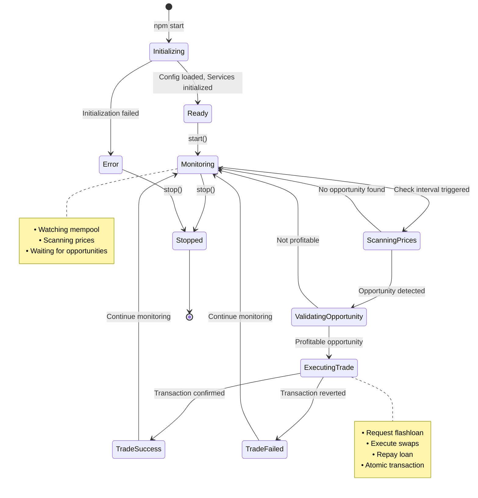
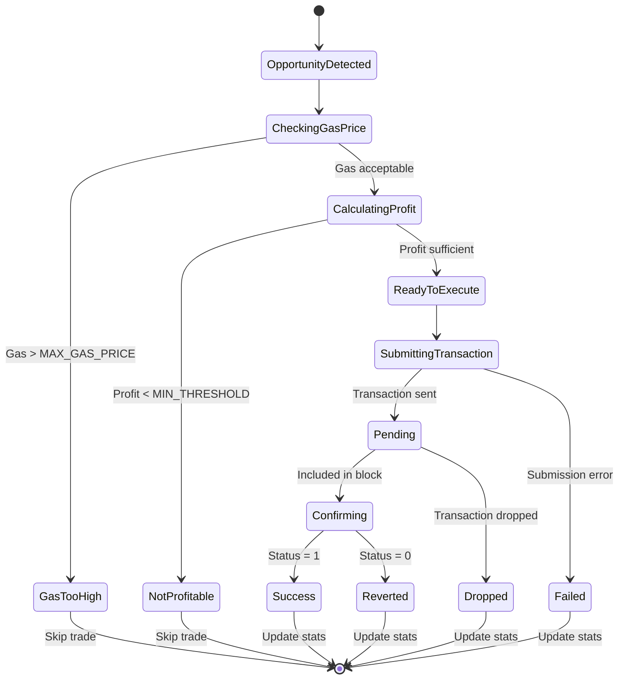

# 🎨 UML Diagrams - Ethereum MEV Arbitrage Bot

## Table of Contents
- [System Architecture](#system-architecture)
- [Class Diagram](#class-diagram)
- [Sequence Diagrams](#sequence-diagrams)
- [Component Diagram](#component-diagram)
- [State Diagram](#state-diagram)
- [Deployment Diagram](#deployment-diagram)

---

## System Architecture

### High-Level Architecture

```
┌─────────────────────────────────────────────────────────────────────┐
│                        MEV ARBITRAGE BOT SYSTEM                      │
└─────────────────────────────────────────────────────────────────────┘

┌──────────────────┐         ┌──────────────────┐         ┌──────────────────┐
│                  │         │                  │         │                  │
│  Ethereum Node   │◄────────┤  Arbitrage Bot   │────────►│ Telegram API     │
│  (RPC/WSS)       │         │  (Node.js)       │         │                  │
│                  │         │                  │         │                  │
└──────────────────┘         └──────────────────┘         └──────────────────┘
        ▲                             │                            │
        │                             │                            │
        │                             ▼                            ▼
        │                    ┌──────────────────┐         ┌──────────────────┐
        │                    │                  │         │                  │
        │                    │  Smart Contract  │         │  User/Developer  │
        │                    │  (Solidity)      │         │                  │
        │                    │                  │         │                  │
        │                    └──────────────────┘         └──────────────────┘
        │                             │
        └─────────────────────────────┘

┌─────────────────────────────────────────────────────────────────────┐
│                              DEX Layer                               │
├─────────────────────────────────────────────────────────────────────┤
│  ┌──────────────┐  ┌──────────────┐  ┌──────────────┐              │
│  │  Uniswap V2  │  │  SushiSwap   │  │  Uniswap V3  │   ...more    │
│  └──────────────┘  └──────────────┘  └──────────────┘              │
└─────────────────────────────────────────────────────────────────────┘

┌─────────────────────────────────────────────────────────────────────┐
│                           Flashloan Provider                         │
├─────────────────────────────────────────────────────────────────────┤
│                            Aave V3                                   │
└─────────────────────────────────────────────────────────────────────┘
```

---

## Class Diagram

### Core Classes



### Data Models



---

## Sequence Diagrams

### 1. Bot Startup Sequence



### 2. Arbitrage Detection and Execution



### 3. Flashloan Arbitrage Execution Flow



### 4. Price Monitoring Flow



---

## Component Diagram

```
┌─────────────────────────────────────────────────────────────────────────┐
│                          ARBITRAGE BOT SYSTEM                            │
└─────────────────────────────────────────────────────────────────────────┘

┌──────────────────────┐
│   Entry Point        │
│   (src/index.js)     │
└──────────┬───────────┘
           │
           ▼
┌──────────────────────────────────────────────────────────────────────┐
│                         Core Layer                                    │
├──────────────────────────────────────────────────────────────────────┤
│  ┌────────────────────────────────────────────────────────────────┐  │
│  │              ArbitrageBot (src/bot/)                           │  │
│  │  • Orchestrates all operations                                 │  │
│  │  • Makes trading decisions                                     │  │
│  │  • Manages bot lifecycle                                       │  │
│  └────────────────────────────────────────────────────────────────┘  │
└──────────────────────────────────────────────────────────────────────┘
           │
           ├──────────────┬──────────────┬──────────────┬──────────────┐
           ▼              ▼              ▼              ▼              ▼
┌──────────────────────────────────────────────────────────────────────┐
│                        Services Layer                                 │
├──────────────────────────────────────────────────────────────────────┤
│  ┌──────────────┐ ┌──────────────┐ ┌──────────────┐ ┌─────────────┐ │
│  │ PriceFetcher │ │ GasEstimator │ │    Profit    │ │  Telegram   │ │
│  │              │ │              │ │  Calculator  │ │  Notifier   │ │
│  │ • Fetch DEX  │ │ • Estimate   │ │ • Calculate  │ │ • Send      │ │
│  │   prices     │ │   gas prices │ │   profits    │ │   alerts    │ │
│  │ • Cache data │ │ • EIP-1559   │ │ • Validate   │ │ • Daily     │ │
│  │ • Multi-DEX  │ │   support    │ │   trades     │ │   reports   │ │
│  └──────────────┘ └──────────────┘ └──────────────┘ └─────────────┘ │
└──────────────────────────────────────────────────────────────────────┘
           │
           ├──────────────┬──────────────┐
           ▼              ▼              ▼
┌──────────────────────────────────────────────────────────────────────┐
│                        Utilities Layer                                │
├──────────────────────────────────────────────────────────────────────┤
│  ┌──────────────┐ ┌──────────────┐ ┌──────────────┐                 │
│  │    Logger    │ │    Config    │ │   ABIs       │                 │
│  │  (Winston)   │ │  (dotenv)    │ │  (JSON)      │                 │
│  └──────────────┘ └──────────────┘ └──────────────┘                 │
└──────────────────────────────────────────────────────────────────────┘
           │
           ▼
┌──────────────────────────────────────────────────────────────────────┐
│                     Blockchain Layer                                  │
├──────────────────────────────────────────────────────────────────────┤
│  ┌────────────────────────────────────────────────────────────────┐  │
│  │              Smart Contract (Solidity)                         │  │
│  │         contracts/FlashloanArbitrage.sol                       │  │
│  │  • Execute flashloan arbitrage                                 │  │
│  │  • Interact with DEXes                                         │  │
│  │  • Manage profits                                              │  │
│  └────────────────────────────────────────────────────────────────┘  │
└──────────────────────────────────────────────────────────────────────┘
           │
           ▼
┌──────────────────────────────────────────────────────────────────────┐
│                     External Services                                 │
├──────────────────────────────────────────────────────────────────────┤
│  ┌──────────┐  ┌──────────┐  ┌──────────┐  ┌──────────┐             │
│  │ Ethereum │  │   DEXes  │  │   Aave   │  │ Telegram │             │
│  │   Node   │  │  (V2/V3) │  │   Pool   │  │   API    │             │
│  └──────────┘  └──────────┘  └──────────┘  └──────────┘             │
└──────────────────────────────────────────────────────────────────────┘
```

---

## State Diagram

### Bot State Machine



### Trade Execution States



---

## Deployment Diagram

```
┌─────────────────────────────────────────────────────────────────────┐
│                         Production Environment                       │
└─────────────────────────────────────────────────────────────────────┘

┌────────────────────────────────────────────────────────────────────┐
│                          User Machine                               │
│  ┌──────────────────────────────────────────────────────────────┐  │
│  │                     Developer                                 │  │
│  │  • Configuration                                              │  │
│  │  • Monitoring                                                 │  │
│  │  • Telegram App                                               │  │
│  └──────────────────────────────────────────────────────────────┘  │
└────────────────────────────────────────────────────────────────────┘
                                │
                                │ SSH / HTTPS
                                ▼
┌────────────────────────────────────────────────────────────────────┐
│                    VPS / Cloud Server (AWS/DigitalOcean)            │
│  OS: Ubuntu 20.04 LTS                                               │
│  Location: us-east-1 (Low latency to Ethereum nodes)               │
│  ┌──────────────────────────────────────────────────────────────┐  │
│  │                       Node.js Runtime                         │  │
│  │  Version: 16.x LTS                                            │  │
│  │  ┌────────────────────────────────────────────────────────┐  │  │
│  │  │            PM2 Process Manager                          │  │  │
│  │  │  ┌──────────────────────────────────────────────────┐  │  │  │
│  │  │  │         MEV Arbitrage Bot                        │  │  │  │
│  │  │  │  • src/index.js (Entry point)                    │  │  │  │
│  │  │  │  • src/bot/ (Core logic)                         │  │  │  │
│  │  │  │  • src/services/ (Services)                      │  │  │  │
│  │  │  │  • src/utils/ (Utilities)                        │  │  │  │
│  │  │  └──────────────────────────────────────────────────┘  │  │  │
│  │  └────────────────────────────────────────────────────────┘  │  │
│  └──────────────────────────────────────────────────────────────┘  │
│  ┌──────────────────────────────────────────────────────────────┐  │
│  │                    File System                                │  │
│  │  • /app/ (Application code)                                   │  │
│  │  • /logs/ (Log files)                                         │  │
│  │  • /.env (Environment variables - secured)                    │  │
│  └──────────────────────────────────────────────────────────────┘  │
└────────────────────────────────────────────────────────────────────┘
                                │
                                │ HTTPS/WSS
                                ▼
┌────────────────────────────────────────────────────────────────────┐
│                    RPC Provider (Infura/Alchemy)                    │
│  ┌──────────────────────────────────────────────────────────────┐  │
│  │              WebSocket Connection (Real-time)                 │  │
│  │  • Block updates                                              │  │
│  │  • Mempool transactions                                       │  │
│  │  • Event subscriptions                                        │  │
│  └──────────────────────────────────────────────────────────────┘  │
└────────────────────────────────────────────────────────────────────┘
                                │
                                ▼
┌────────────────────────────────────────────────────────────────────┐
│                        Ethereum Mainnet                             │
│  ┌──────────────────────────────────────────────────────────────┐  │
│  │                  Smart Contracts                              │  │
│  │  ┌────────────────┐  ┌────────────────┐  ┌────────────────┐  │  │
│  │  │ Flashloan      │  │ Uniswap V2     │  │ SushiSwap      │  │  │
│  │  │ Arbitrage      │  │ Router         │  │ Router         │  │  │
│  │  │ (Deployed)     │  │                │  │                │  │  │
│  │  └────────────────┘  └────────────────┘  └────────────────┘  │  │
│  │  ┌────────────────┐  ┌────────────────┐                      │  │
│  │  │ Uniswap V3     │  │ Aave Pool      │                      │  │
│  │  │ Router         │  │                │                      │  │
│  │  └────────────────┘  └────────────────┘                      │  │
│  └──────────────────────────────────────────────────────────────┘  │
└────────────────────────────────────────────────────────────────────┘

                                │
                                │ HTTPS
                                ▼
┌────────────────────────────────────────────────────────────────────┐
│                        Telegram API                                 │
│  • Bot API                                                          │
│  • Message delivery                                                 │
│  • Notifications                                                    │
└────────────────────────────────────────────────────────────────────┘
```

---

## Data Flow Diagram

```
┌─────────────────────────────────────────────────────────────────┐
│                      DATA FLOW DIAGRAM                           │
└─────────────────────────────────────────────────────────────────┘

                    ┌──────────────┐
                    │  Ethereum    │
                    │  Blockchain  │
                    └──────┬───────┘
                           │
              ┌────────────┼────────────┐
              │            │            │
              ▼            ▼            ▼
       ┌──────────┐  ┌──────────┐  ┌──────────┐
       │ Uniswap  │  │ SushiSwap│  │   Aave   │
       │   V2/V3  │  │          │  │   Pool   │
       └────┬─────┘  └────┬─────┘  └────┬─────┘
            │             │             │
            │ Price Data  │ Price Data  │ Flashloan
            │             │             │
            └─────────────┼─────────────┘
                          │
                          ▼
                 ┌─────────────────┐
                 │  PriceFetcher   │
                 │  • Fetch prices │
                 │  • Cache        │
                 └────────┬────────┘
                          │
                          │ Prices Object
                          │
                          ▼
                 ┌─────────────────┐
                 │ ArbitrageBot    │
                 │ • Find opp      │
                 └────────┬────────┘
                          │
            ┌─────────────┼─────────────┐
            │             │             │
            ▼             ▼             ▼
     ┌────────────┐ ┌────────────┐ ┌──────────────┐
     │    Gas     │ │   Profit   │ │  Telegram    │
     │ Estimator  │ │ Calculator │ │  Notifier    │
     └──────┬─────┘ └──────┬─────┘ └──────┬───────┘
            │              │              │
            │ Gas Price    │ Profit Info  │ Notifications
            │              │              │
            └──────────────┼──────────────┘
                           │
                           ▼
                  ┌─────────────────┐
                  │ Decision Logic  │
                  │ Execute?        │
                  └────────┬────────┘
                           │
                           │ Execute Command
                           │
                           ▼
                  ┌─────────────────┐
                  │ Smart Contract  │
                  │ (On-chain)      │
                  └────────┬────────┘
                           │
                           │ Transaction
                           │
                           ▼
                  ┌─────────────────┐
                  │   Ethereum      │
                  │   Network       │
                  └────────┬────────┘
                           │
                           │ Receipt
                           │
                           ▼
                  ┌─────────────────┐
                  │  Logs & Stats   │
                  │  Database       │
                  └─────────────────┘
```

---

## Technology Stack

```
┌─────────────────────────────────────────────────────────────┐
│                     TECHNOLOGY STACK                         │
└─────────────────────────────────────────────────────────────┘

Backend (Node.js)
├── Runtime: Node.js v16+
├── Language: JavaScript (ES6+)
├── Framework: None (Pure Node.js)
└── Package Manager: npm / yarn

Libraries & Dependencies
├── Blockchain
│   ├── ethers.js v5.7.2 (Ethereum interaction)
│   ├── web3.js v1.10.0 (Alternative Ethereum library)
│   └── hardhat v2.14.0 (Development environment)
├── DeFi Protocols
│   ├── @uniswap/v2-periphery
│   ├── @uniswap/v3-periphery
│   └── @aave/core-v3
├── Utilities
│   ├── dotenv (Environment variables)
│   ├── axios (HTTP requests)
│   ├── bignumber.js (Precise calculations)
│   └── winston (Logging)
├── Notifications
│   └── telegraf (Telegram bot)
└── Scheduling
    └── node-cron (Scheduled tasks)

Smart Contracts
├── Language: Solidity v0.8.19
├── Framework: Hardhat
├── Testing: Waffle + Chai
└── Libraries: OpenZeppelin, Aave V3

Infrastructure
├── Server: VPS (AWS, DigitalOcean, etc.)
├── OS: Ubuntu 20.04 LTS
├── Process Manager: PM2
└── Reverse Proxy: Nginx (optional)

External Services
├── RPC Provider: Infura / Alchemy
├── Blockchain: Ethereum Mainnet
├── Messaging: Telegram API
└── Block Explorer: Etherscan API

Development Tools
├── Version Control: Git
├── Code Editor: VSCode / Cursor
├── Linter: ESLint
└── Testing: Jest + Hardhat
```

---

## Security Architecture

```
┌─────────────────────────────────────────────────────────────┐
│                   SECURITY LAYERS                            │
└─────────────────────────────────────────────────────────────┘

Layer 1: Infrastructure Security
├── Firewall: UFW configured
├── SSH: Key-based authentication only
├── Updates: Automatic security updates
└── Monitoring: System monitoring tools

Layer 2: Application Security
├── Environment Variables: Secure .env file
├── Private Keys: Encrypted storage
├── API Keys: Rotated regularly
└── Rate Limiting: Prevent abuse

Layer 3: Smart Contract Security
├── Access Control: onlyOwner modifiers
├── Reentrancy Protection: Checks-Effects-Interactions
├── Emergency Functions: Pause & withdraw
└── Audit: Third-party security audit recommended

Layer 4: Operational Security
├── Profit Limits: Min/max thresholds
├── Gas Limits: Maximum gas price
├── Position Sizing: Trade size limits
└── Circuit Breakers: Automatic shutdown triggers

Layer 5: Monitoring & Alerts
├── Real-time Logs: Winston logging
├── Error Tracking: Error notifications
├── Performance Metrics: Stats tracking
└── Telegram Alerts: Instant notifications
```

---

## Scalability Considerations

```
Current Architecture
├── Single bot instance
├── Sequential trade execution
├── Limited to configured tokens
└── Manual intervention required

Future Enhancements
├── Multi-instance deployment
│   └── Parallel opportunity scanning
├── Distributed processing
│   └── Redis for state management
├── Machine Learning integration
│   └── Predictive opportunity detection
├── Cross-chain support
│   └── Multi-blockchain arbitrage
└── Advanced strategies
    ├── Sandwich attacks
    ├── Liquidation arbitrage
    └── NFT arbitrage
```

---

**Note**: These UML diagrams can be rendered using tools like:
- [Mermaid Live Editor](https://mermaid.live/)
- [PlantUML](https://plantuml.com/)
- [Draw.io](https://draw.io/)
- [Lucidchart](https://www.lucidchart.com/)

For best results, copy the Mermaid code blocks into the Mermaid Live Editor.

